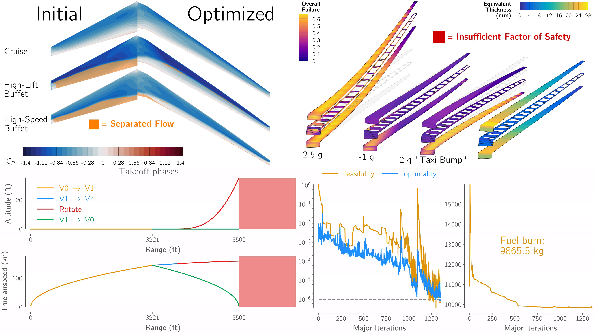

MDO Benchmarks for Aircraft Design
==================================

This is the home of the MDO Benchmarks for Aircraft Design working group.
Similar to the drag prediction and aeroelastic prediction workshops, our goal is to pose a set of benchmark problems that practitioners can use to directly compare their tools to others in the community.
Simultaneously, we aim to use these benchmark problems to identify and close gaps between the current state of the art and the needs of industry.

.. TODO: Add some nice figures?

Background
----------

The MDO Benchmarks for Aircraft Design working group was formed at the 2024 AIAA SciTech Forum, when the Simple Transonic Wing (STW) benchmark model and problems were proposed :cite:`AGray2024a`.
Since then, the working group has refined the STW benchmark problems, and multiple participants have presented results in special sessions at the AIAA SciTech Forums in 2025 and 2026.

A new, more complex, benchmark model, the DLR-F25, was proposed at SciTech 2026 :cite:`Abu-Zurayk2026`, and the working group is currently in the process of finalizing benchmark problems for this model.
For 2026, the working group will continue to work on both the STW and DLR-F25 benchmarks, with the STW acting as a simpler starting point for those new to the benchmarks, and the DLR-F25 acting as a grand-challenge problem.

We encourage participants to present results on either or both of these benchmark problems at the 2027 AIAA SciTech Forum.

Get Involved
------------

Our working group holds a regular meeting once a month to discuss progress on the benchmark problems and plan future activities.
Anyone interested in participating in the working group is welcome to join.
We welcome contributions both from those working on the benchmark problems themselves, and those in industry interested in helping us shape the future direction of the benchmarks.

If you'd like to be added to the working group mailing list, please contact `Kevin Jacobson <kevin.e.jacobson@nasa.gov>`_ or `Graeme Kennedy <graeme.kennedy@aerospace.gatech.edu>`_.

We hold a special session each year at the AIAA SciTech Forum where participants can present their progress and results on the benchmark problems.
We recongnize that tackling these benchmark problems can be a significant undertaking, so we encourage participants to present preliminary results even if they have not yet completed the full benchmark problems.

Benchmarks
----------

.. toctree::
   :maxdepth: 1

   stw/index
   dlr-f25/index

Related Works
-------------

Simple Transonic Wing (STW) Papers
^^^^^^^^^^^^^^^^^^^^^^^^^^^^^^^^^^
.. bibliography:: stw/stw_papers.bib
   :all:

DLR-F25 Papers
^^^^^^^^^^^^^^
.. bibliography:: dlr-f25/f25_papers.bib
   :all:
